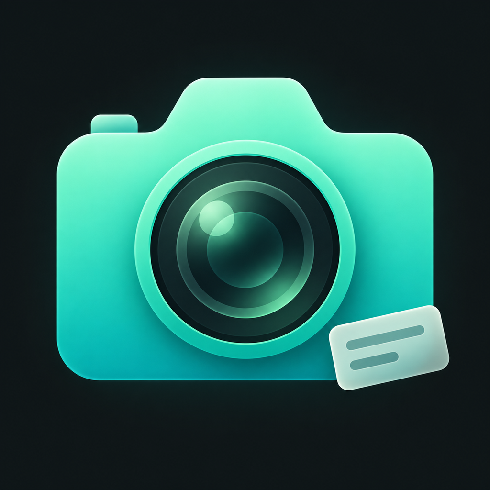

# 印记相机 · MarkCam 1.2.1 修复版

原生 Objective-C iPhone 相机，重点是“先设计水印，之后每次拍摄自动应用”。

本版修复 1.2.0 的拍摄/异步队列状态恢复问题：首次相册授权不再吞掉快门请求，从水印编辑器返回后恢复合成，内存/温度恢复后重新启用快门。另修复录像任务过早进入可处理状态、视频受残留 LIVE 设置限制，以及损坏恢复记录导致异常的问题。

**验证边界：主机回归和交叉编译检查不代表真机拍照通过。** 本版未运行 iOS 模拟器或真机验收；具体复测步骤见 [1.2.1 修复说明](docs/HOTFIX-1.2.1.md)。

<p align="center"></p>
IPA 内仅有 Mach-O ad-hoc 签名，没有 Apple 开发/分发签名与设备描述文件，普通 iPhone 不能直接点开安装。请先用合法有效的签名方式重签。

## 下载文件

本次修复的 IPA、SHA-256 与构建/检查报告随 PR 一并交付，参见 [artifacts/1.2.1](artifacts/1.2.1)。IPA 需要合法重签才能在普通 iPhone 安装。

[GitHub Actions](https://github.com/1052666/MarkCam/actions/workflows/build-ios.yml) 在代码推送后重新编译并检查 IPA，成功运行会上传包含源码包和验证报告的构建附件。历史版本仍可在 [Releases](https://github.com/1052666/MarkCam/releases) 下载。

## 1.2.0：异步合成与资源控制
- 原片及恢复记录先落盘，系统拍摄结束后释放快门；合成/相册保存移入单任务队列，不在界面线程合成。
- 普通照片待处理上限6张，Live接纳条件更保守；不能无限连拍，Live/视频重型处理期间仍限制新拍摄。
- 从文件进行Core Image渲染，减少大图中间副本；水印画布最长边2048px，保留照片尺寸，细小水印可能较软。
- 加入可用内存检查、压力/温度反馈和缓存清理；**尚未实测内存改善，不能保证其他App不被系统回收**。
- 支持暂停及保留待处理素材；切后台只有短时收尾时限，不保证持续运行，失败/不明确保存状态需在“待保存”查看。

详见 [1.2.0 技术说明、限制与未完成测试状态](docs/RELEASE-1.2.0.md)。

## 1.1.1 引入并保留：流畅取景、大画面、超广角
- **流畅取景**：移除20fps时间门槛和逐帧双重UIImage转换；无调色走系统预览，有调色走Metal GPU直接显示。水印后台渲染/缓存，编辑器仅按需快照。
- **流畅优先设置**：始终用系统取景，不实时显示滤镜但成片依然调色，水印可见。默认关闭以保留实时调色；GPU失败明确提示回退。
- **大画面**：照片尽量满宽按实际比例显示，移除卡片边距；竖屏视频满宽16:9，底部按钮浮层；横屏右侧控制，不拉伸/裁掉取景来凑满屏。
- **真实超广角**：后置优先使用Triple/Dual Wide虚拟多镜头，以系统镜头切换倍率映射0.5×/1×等；没有硬件不显示假0.5×。2×不代表必定光学长焦。
- **统一缩放**：快捷按钮、滑杆、双指同步，快速操作合并请求，前后镜头与拍照录像互切保持合理倍率。

详见 [1.1.1 技术说明与验收](docs/RELEASE-1.1.1.md)。[布局示意](docs/layout-review.html)不是App截图，仅来自真实布局函数的坐标。

## 1.1.0 引入并保留的功能

### Live Photo 实况照片
- 顶部 `LIVE` 开关，也可从「设置」开启；默认关闭，不改变旧版普通拍照习惯。
- 原生 AVCapturePhotoOutput 捕捉主照片与前后短视频，不是 GIF 或单纯视频。
- 主照片与动态帧均应用当前调色/水印；日期时间固定为本次快门时间。
- 保留原始照片 Apple 配对标识、MOV content identifier、主照片时间元数据以及原生轨道关联。
- 用 `PHLivePhoto` 对输出配对进行本机验证，再以同一 PhotoKit 资源的 photo + pairedVideo 保存；识别失败会提示并保留原片，不静默保存为普通照片。
- 有声音需要麦克风权限；本版未提供无声实况模式。视频录制模式不可同时拍摄 LIVE。
- 拍摄/合成期间保持前台，点击快门前后让画面稳定；开启或切换镜头后给取景缓冲一点时间。
- 开启「保留原片」时保存两个实况资产：处理成片和原始实况。分享暂存时导出照片+MOV 两个资源；接收 App 不一定自动显示为实况，优先用本 App 保存相册。

### 曝光与缩放界面
- 画面底部为倍率滑杆，支持超广角时从0.5×附近开始，具体范围由镜头能力决定，最高8×显示倍率。
- 双指缩放与滑杆/倍率显示同步；切换镜头后重新读取倍率和支持范围。
- 右上角「设置」直接定位到 **EV 曝光补偿**，可调 -2～+2 EV、记住设置、一键恢复0。
- EV 调整在返回实时取景后作用于摄像头；不会改变设置页里的已拍预览帧。
- 普通照片在原片落盘、系统拍摄结束后可继续拍；队列上限、内存压力、Live/视频重型处理仍会限制控件。每个作品按拍摄时的设置快照合成。

## 原有功能

### 拍摄
- 原生高质量 JPEG 照片；非预览截图。
- 前置广角与后置虚拟多镜头（支持时含超广角），点击对焦、快捷倍率/双指/滑杆缩放、EV曝光补偿。
- 闪光灯关闭/自动/开启，视频开启模式使用设备补光灯。
- 九宫格、3秒/10秒倒计时、横竖屏和前置镜像选项。
- 有声录像：目标1080p30，单段上限5分钟；设备能力可能影响实际参数。
- 拍摄后自动保存系统相册，可选择同时保存未调色/未加水印原片。

### 调色
亮度、对比度、饱和度、冷暖；原图/清透/暖色/复古/黑白预设。

1.1.1起不再限为20fps或逐帧转UIImage：中性调色直接系统预览，有调色时Metal输出最长边1280px预览纹理；最终照片使用原生输出尺寸。
如果设备不能同时使用视频文件输出与帧数据输出，或GPU不可用/选择流畅优先，明确标示原生预览：水印可见，调色在最终成片中应用。

### 水印工坊
- 多图层文字、多行文字、日期时间、透明图片；相册和文件导入图片。
- 拖动、双指缩放、旋转；水平/垂直位置、字号、宽度、透明度滑杆。
- 自定义文字颜色、系统/衬线/等宽字体、粗体、阴影、背景底板。
- 图层选中、复制、锁定、删除与前后层级。
- 6种预设：极简签名、日期胶片、品牌标识、信息卡片、工作记录、全图平铺。
- 自定义模板保存、切换、同名覆盖确认和删除。
- 当前模板和调色自动保存；App重开后恢复。
- JSON备份包含设置、个人模板和内嵌图片，可导入/导出。
- 文字 `{date}` → 当次拍摄日期，`{time}` → 当次拍摄时间。视频固定为开始录制时间，并非逐秒动态时钟。

文字/图片水印真实合成进照片和视频，不是仅出现在界面上。调色先作用于底图，再合成水印，水印颜色不会被滤镜改变。

### 数据保护
- 相片、原始录像与恢复记录先保存到 Documents/Pending。
- 导出、相册保存失败或被取消时保留原始素材，可在“待保存”重试或分享。
- 相册保存成功后再清理相应暂存；手动删除需要二次确认。
- 切后台停止新任务派发并请求取消Live/视频合成，短时系统后台时限只用于收尾。回到前台恢复可执行任务，失败或不明确状态到“待保存”查看。
- 文件 App → 我的 iPhone → 印记相机可访问本机文档，手动备份素材。

## 快速使用
1. 完成合法重签后安装，首次打开允许相机权限。
2. 点“水印 · 模板 · 调色”进入水印工坊。
3. 从内置预设开始，或“添加”文字、日期、图片。
4. 点选下方图层，在顶部画布拖动/双指缩放/旋转，调整颜色、大小等。
5. 点“完成”返回相机，水印设置已保存在本机。
6. 按快门拍照；第一次保存时允许“添加照片”权限。
7. 视频模式需要麦克风权限；停止录制后保持App前台，等待合成与保存。
8. 保存失败时不要卸载App，先到“待保存”重试或导出。

## 首版限制 / 未验证事项
- GPU预览方向/颜色、超广角Live/录像、布局与实际流畅度仍待真机复测；编译和主机测试不能证明达到iOS原相机帧率。
- Live Photo 是否支持取决于当前摄像头与设备格式，首次开启可能需要重新配置管线。主照片时间与动态播放、长按识别、前置镜像水印均需实机检查。
- 无法给苹果系统相机自动加水印，只作用于本App内拍摄。
- 目前照片为相机原生比例，没有额外的1:1/16:9裁切菜单。
- 支持超广角虚拟多镜头选择，系统可按光线选择物理镜头或裁切；2×不是光学镜头承诺，录像开始后锁定倍率与镜头。
- 没有ProRAW、HDR专用管线、电影模式、美颜或逐秒变化视频水印。
- 水印超出画面部分会被裁切，放到边缘时需自行保留安全距离。
- 文字居中排版；底板颜色/圆角固定，阴影可开关；无自定义描边、任意字体文件导入。
- 图片水印支持位置、尺寸、旋转、透明度，不提供图片一键换色。
- 已保存作品在系统“照片”查看，本App没有请求读整个图库的权限。
- 设置与水印素材在本机，卸载会丢失；请导出模板备份。
- 模板导入上限32MB、单图片输入20MB，导入时缩小到最长边2048px。普通编辑最多48图层、30个个人模板。
- 合成长视频请保持App前台；锁屏、来电、空间不足可能中断，暂存文件需手动恢复。
- 极端中断（相册已写入但清理状态尚未落盘）可能导致重试重复保存；可在照片App删除重复件。

## 隐私
不需要账号或服务器。应用代码没有上传照片/网络请求逻辑，不申请定位，不读取整个相册。相机权限在拍照使用时申请，麦克风权限在使用有声录像或 Live Photo 时申请，相册添加权限在首次保存时申请。系统照片自身可能按你的iCloud设置同步，这不由本App控制。

## 安装签名
当前包需重签，不是App Store或TestFlight发行版本。
- 已有合法签名工具/证书：导入IPA，选对应证书和描述文件重签安装。
- 有电脑：可考虑Sideloadly/AltStore等合法侧载方式；是否需要开启开发者模式、续签周期依工具和账号类型而定。
- 不要把Apple ID密码或证书私钥发送到聊天；优先在自己的签名工具本地输入。
- 使用与旧版一致的 Bundle ID 和签名身份覆盖安装，不要先卸载；通常可保留模板与暂存素材，升级前仍建议导出备份。
- GitHub 凭据不能替代 Apple 签名证书。本仓库和 Release 不包含令牌、证书、设备描述文件、原始崩溃日志或用户照片。

## 本地重新构建
工具：Alpine `clang lld zip curl py3-pillow`。SDK：theos公开release的iPhoneOS16.5.sdk，解压到 `/tmp/iPhoneOS16.5.sdk`（支持符号链接的Linux路径）。

```sh
python3 scripts/build.py
python3 scripts/validate.py
python3 tests/test_capture_recovery.py
python3 tests/test_photo_contract.py
python3 tests/test_live_ui.py
python3 tests/test_preview.py      # 主机执行同一C布局/倍率函数
python3 tests/render_layout_review.py
python3 scripts/publish-local.py  # 生成源码压缩包和 SHA256SUMS
```

可通过 `IOS_SDK` 指定SDK路径。脚本只清理本项目 `build/release/`，不清理其他项目。无需GitHub令牌编译。若未来用于正式商店发行，建议迁移官方Xcode/SDK并完成完整签名、隐私及真机测试。

## 检查结论的边界
- 新增拍摄恢复回归：执行实际 C 资源策略，并检查 Objective-C 生命周期、授权和落盘屏障接线。
- 旧测试已迁移到 `MCProcessingQueue` 和 `MCPhotoRenderer`，不再错误地到控制器中寻找已经迁出的相册保存/合成实现。
- 编译回归包含正确回调编译通过、故意恢复旧版回调拼写错误时编译失败的正反检查；另检查 IPA 中真实的 Objective-C 方法表和 arm64 Mach-O 结构。
- 所有结果均不证明相机画质、Live Photo 播放、iOS 内存峰值或真机连续拍摄通过，仍需安装复测。

## 本地诊断
1.0.1 在拍照请求被系统拒绝时显示错误并恢复快门状态；最近一次错误写入 `Documents/LastCaptureError.json`，可从文件 App 导出。该文件包含错误原因和时间，不上传服务器。请勿将带私人信息的日志直接提交到公开 Issue。

详见 [1.1.0 实况与界面说明](docs/RELEASE-1.1.0.md)、[原闪退修复说明](docs/HOTFIX-1.0.1.md) 与 [真机验收清单](docs/DEVICE-TESTS.md)。
